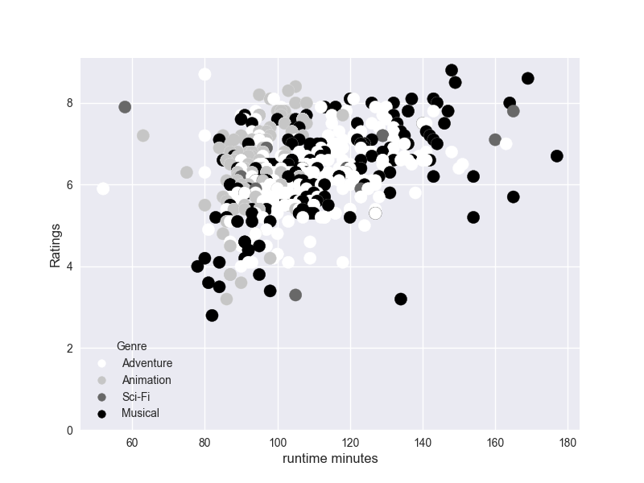

# Microsoft Movie Studio Recommendation

## Project Overview

This project aims to assist Microsoft's new movie studio in achieving breakthrough success within the competitive film industry. By providing actionable insights and analysis of current trends, the project seeks to guide decision-making processes related to film production, director hiring, and runtime considerations. The ultimate goal is to maximize return on investment (ROI), ensure long-term profitability, and establish the studio as a formidable player in the market.

## Business Problem

Microsoft's movie studio faces the challenge of entering a highly competitive industry and needs strategic guidance to make informed decisions. By understanding the types of films that are currently successful at the box office, the studio can focus on genres with high earning potential, collaborate with top-performing directors, and optimize movie runtime to align with audience preferences. This project addresses these critical areas, providing valuable insights to enhance the studio's chances of success.

## The Data

The analysis relies on data from reputable sources such as IMDB, Box Office Mojo, and the IMDB database accessed through SQL. These sources offer comprehensive information on movie genres, box office earnings, director performance, and runtime metrics. By leveraging this data, a comprehensive analysis is conducted to extract meaningful insights.

## Key Insights

1. Genres: Animation, Adventure, and Sci-Fi consistently demonstrate high box office earnings, even with relatively modest budgets. These genres have proven market demand and audience appeal.

The best release date should on from may to august,

2. Directors: Certain directors exhibit exceptional Return on Investment (ROI) and consistently receive high ratings. Notably, Kyle Balda has >

3. Runtimes: Optimal movie runtimes vary across genres. Animation movies tend to perform well with shorter runtimes, approximately 110 minutes>

## Recommendation for Microsoft

Based on the key insights gained from the analysis, the following recommendations are proposed for Microsoft's movie studio:

1. Genre Selection: Prioritize the production of movies within the Adventure, Animation, and Sci-Fi genres, as they have a proven track record>

2. Director Hiring: Collaborate with directors who have demonstrated a strong ROI and consistently received high ratings. Eric Piccoli is an e>

3. Runtime Optimization: Tailor the runtime duration of movies to align with audience preferences within each genre. Animation movies should a>

By implementing these recommendations, Microsoft's movie studio can increase the likelihood of producing successful and profitable movies. The>

2. Directors: Certain directors exhibit exceptional Return on Investment (ROI) and consistently receive high ratings. Notably, Kyle Balda has demonstrated success in the Animation genre and is a recommended choice for collaboration.

3. Runtimes: Optimal movie runtimes vary across genres. Animation movies tend to perform well with shorter runtimes, approximately 110 minutes, while other genres may have different audience preferences. Customizing the runtime to each genre enhances audience engagement.

## Recommendation for Microsoft

Based on the key insights gained from the analysis, the following recommendations are proposed for Microsoft's movie studio:

1. Genre Selection: Prioritize the production of movies within the Adventure, Animation, and Sci-Fi genres, as they have a proven track record of high box office earnings.

2. Director Hiring: Collaborate with directors who have demonstrated a strong ROI and consistently received high ratings. Eric Piccoli is an excellent choice and is recommended for collaboration, while other genres should seek directors with exceptional talent and commercial success.

3. Runtime Optimization: Tailor the runtime duration of movies to align with audience preferences within each genre. Animation movies should aim for a runtime of approximately 110 minutes, while other genres should conduct market research and consider audience feedback to determine ideal runtimes.

By implementing these recommendations, Microsoft's movie studio can increase the likelihood of producing successful and profitable movies. These insights will guide resource allocation, attract top talent, and deliver captivating stories that resonate with audiences. With a strategic approach and data-driven decision-making, Microsoft can establish a strong foothold in the film industry.

## Repository Structure

- `data/`: Contains the movie dataset used for analysis.
- `index.ipynb/`: Jupyter notebooks used for data exploration and analysis.
- `images/`: contains pictures
- `README.md`: This file, providing an overview of the project and its insights